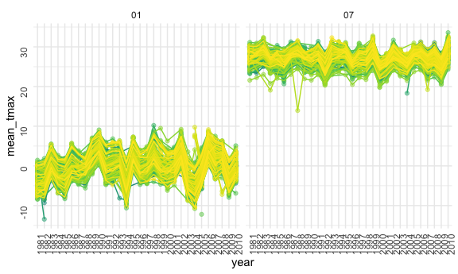
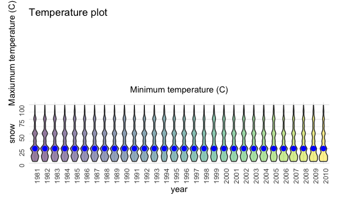

p8105\_homework3
================
Meiju Chen
10/8/2020

## Problem 1

``` r
data("instacart")
```

This dataset contains 1384617 rows and 15 columns. Observations are the
level of items in orders by user. There are user / order variables –
user ID, order ID, order day and order hour. There are also item
variables – name, aisle, department and some numeric codes.

##### How many aisles are there, and which aisles are the most items ordered from?

    ## # A tibble: 134 x 2
    ##    aisle                              n
    ##    <chr>                          <int>
    ##  1 fresh vegetables              150609
    ##  2 fresh fruits                  150473
    ##  3 packaged vegetables fruits     78493
    ##  4 yogurt                         55240
    ##  5 packaged cheese                41699
    ##  6 water seltzer sparkling water  36617
    ##  7 milk                           32644
    ##  8 chips pretzels                 31269
    ##  9 soy lactosefree                26240
    ## 10 bread                          23635
    ## # … with 124 more rows

##### Make a plot. Show the number of items ordered in each aisle, limit this to aisles with more than 10000 items ordered.


##### Make a table.

Show the three most popular items in each of the aisles “baking
ingredients”, “dog food care”, and “packaged vegetables fruits”.

| aisle                      | product\_name                                 |    n | rank |
| :------------------------- | :-------------------------------------------- | ---: | ---: |
| baking ingredients         | Light Brown Sugar                             |  499 |    1 |
| baking ingredients         | Pure Baking Soda                              |  387 |    2 |
| baking ingredients         | Cane Sugar                                    |  336 |    3 |
| dog food care              | Snack Sticks Chicken & Rice Recipe Dog Treats |   30 |    1 |
| dog food care              | Organix Chicken & Brown Rice Recipe           |   28 |    2 |
| dog food care              | Small Dog Biscuits                            |   26 |    3 |
| packaged vegetables fruits | Organic Baby Spinach                          | 9784 |    1 |
| packaged vegetables fruits | Organic Raspberries                           | 5546 |    2 |
| packaged vegetables fruits | Organic Blueberries                           | 4966 |    3 |

##### Make a table. Show the mean hour of the day at which Pink Lady Apples and Coffee Ice Cream are ordered on each day of the week.

    ## `summarise()` regrouping output by 'product_name' (override with `.groups` argument)

    ## # A tibble: 2 x 8
    ## # Groups:   product_name [2]
    ##   product_name       `0`   `1`   `2`   `3`   `4`   `5`   `6`
    ##   <chr>            <dbl> <dbl> <dbl> <dbl> <dbl> <dbl> <dbl>
    ## 1 Coffee Ice Cream  13.8  14.3  15.4  15.3  15.2  12.3  13.8
    ## 2 Pink Lady Apples  13.4  11.4  11.7  14.2  11.6  12.8  11.9

## Problem 2

##### Load, tidy, and otherwise wrangle the data. Include all originally observed variables and values; have useful variable names; include a weekday vs weekend variable; and encode data with reasonable variable classes.

``` r
accel_df = read_csv(
  "./data/accel_data.csv") %>%
  janitor::clean_names() %>% 
  pivot_longer(
    activity_1:activity_1440,
    names_to = "minute",
    names_prefix = "activity_",
    values_to = "activity_count"
    ) %>% 
  mutate(
    activity_count = round(activity_count, digits = 0)
    ) %>% 
  mutate(minute = as.integer(minute),
         activity_count = as.integer(activity_count),
         ) %>% 
  mutate(day_type = case_when(
    day %in% c("Saturday", "Sunday") ~ "Weekend",
    day %in% c("Monday", "Tuesday", "Wednesday", "Thursday", "Friday") ~ "Weekday")) %>% 
  mutate(
    day = ordered(
      day, levels = c("Monday", "Tuesday", "Wednesday", "Thursday", 
                                      "Friday","Saturday", "Sunday"))
    ) %>% 
  arrange(week, day)
```

    ## Parsed with column specification:
    ## cols(
    ##   .default = col_double(),
    ##   day = col_character()
    ## )

    ## See spec(...) for full column specifications.

The dataset contains 50400 observations and 6 variables. There are
several variables for time – week, day id, day of the week,
weekday/weekend, and the minute of the day. Also, there is a variable
showing activity of the person in a specific minute.

##### Total activity over the day.

``` r
accel_df %>% 
  group_by(week, day) %>% 
  summarize(
    daily_activity = sum(activity_count)
  ) %>% 
  pivot_wider(
    names_from = day,
    values_from = daily_activity
  ) %>% 
  knitr::kable()
```

    ## `summarise()` regrouping output by 'week' (override with `.groups` argument)

| week | Monday | Tuesday | Wednesday | Thursday | Friday | Saturday | Sunday |
| ---: | -----: | ------: | --------: | -------: | -----: | -------: | -----: |
|    1 |  78830 |  307103 |    340113 |   355948 | 480534 |   376254 | 631105 |
|    2 | 295431 |  423245 |    440962 |   474048 | 568839 |   607175 | 422018 |
|    3 | 685910 |  381507 |    468869 |   371230 | 467420 |   382928 | 467052 |
|    4 | 409450 |  319568 |    434460 |   340291 | 154049 |     1440 | 260617 |
|    5 | 389080 |  367824 |    445366 |   549658 | 620860 |     1440 | 138421 |

Throughout the 5 weeks, it seems that the person has steady activity
counts during the weekdays, except for Monday in Week 1. The person was
more active than usual on the Saturday of Week 1 and Week 2, and less
active on the Saturday of Week 4 and Week 5.

##### Make a single-panel plot that shows the 24-hour activity time courses for each day.

``` r
accel_df %>% 
  group_by(day_id) %>% 
  ggplot(aes(x = minute, y = activity_count, color = day)) +
  geom_point(alpha = 0.5) +
  geom_line()
```


It seems that the person is more active around 10-12am, while less
active at other time periods on Sundays in the week. Also, the person is
active at Friday and Saturday nights.

## Problem 3

``` r
data("ny_noaa")
```

This dataset has 2595176 rows and 7 columns, containing weather
information collected by New York State weather stations. The variables
include: weather station id, observation date, precipitation, snowfall,
snow depth and maximum and minimum of temperature. There are a lot of
missing values, especially for the maximum temperatures and minimum
temperatures. However, we have a large number of observations available,
so this will not be a big issue.

##### Do some data cleaning. Create separate variables for year, month, and day. Ensure observations for temperature, precipitation, and snowfall are given in reasonable units.

``` r
weather_df = 
  mutate(ny_noaa,
         tmin = as.numeric(tmin),
         tmax = as.numeric(tmax),
         prcp = as.numeric(prcp)) %>% 
  mutate(tmin = tmin / 10,
         tmax = tmax / 10,
         prcp = prcp / 10) %>% 
  separate(date, into = c("year", "month", "day"), sep = "-" ) 
weather_df %>% 
  count(snow) %>%
  mutate(rank = min_rank(n))
```

    ## # A tibble: 282 x 3
    ##     snow       n  rank
    ##    <int>   <int> <int>
    ##  1   -13       1     1
    ##  2     0 2008508   282
    ##  3     3    8790   273
    ##  4     5    9748   275
    ##  5     8    9962   276
    ##  6    10    5106   271
    ##  7    13   23095   279
    ##  8    15    3672   267
    ##  9    18    3226   266
    ## 10    20    4797   270
    ## # … with 272 more rows

  - “0” is the most observed value. Because there is no snow fall in
    most days in a year in New York.

##### Make a two-panel plot. Show the average max temperature in January and in July in each station across years.

``` r
weather_df %>% 
  filter(month %in% c("01", "07")) %>% 
  group_by(id, year, month) %>%
  summarise(mean_tmax = mean(tmax, na.rm = TRUE)) %>% 
  ggplot(aes(x = year, y = mean_tmax, group = id, color = id)) +
  geom_point(alpha = 0.5) + 
  geom_path() +
  facet_grid(. ~ month) +
  theme(
    axis.text = element_text(
      angle = 90, vjust = 0.5, hjust = 1
      ),legend.position = "none")
```

    ## `summarise()` regrouping output by 'id', 'year' (override with `.groups` argument)

    ## Warning: Removed 5970 rows containing missing values (geom_point).

    ## Warning: Removed 5931 row(s) containing missing values (geom_path).



  - The maximum temperatures fluctuated in both January and July across
    the years, and the fluctuation is larger in January.
  - In 1994 and 2004, the max temperatures in January is lower than
    usual.
  - There are outliers in January in 1982, 2004 and 2005, and in July in
    1984 and 2004.

##### Make another two-panel plot. (i) show tmax vs tmin; and (ii) s the distribution of snowfall values greater than 0 and less than 100 separately by year.

``` r
library(p8105.datasets)
library(patchwork)
```

``` r
tmax_tmin_plot =
weather_df %>% 
  ggplot(aes(x = tmax, y = tmin)) + 
  geom_hex() +
  theme(legend.position = "bottom",
        legend.text = element_text(angle = 60, vjust = 0.5, hjust = 1)) +
  labs(
    title = "Temperature plot",
    x = "Minimum temperature (C)",
    y = "Maxiumum temperature (C)"
  )
```

``` r
snow_distribution_plot =
weather_df %>% 
  filter(snow > 0, snow < 100) %>% 
  ggplot(aes(x = year, y = snow)) + 
  geom_violin(aes(fill = year), alpha = .5) +
  stat_summary(fun = "median", color = "blue") +
  theme(axis.text = element_text(angle = 90, vjust = 0.5, hjust = 1),
        legend.position = "none")
  labs(
    title = "Snowfall distribution plot",
    x = "snowfall (mm)") 
```

    ## $x
    ## [1] "snowfall (mm)"
    ## 
    ## $title
    ## [1] "Snowfall distribution plot"
    ## 
    ## attr(,"class")
    ## [1] "labels"

``` r
tmax_tmin_plot / snow_distribution_plot
```

    ## Warning: Removed 1136276 rows containing non-finite values (stat_binhex).

    ## Warning: Computation failed in `stat_binhex()`:
    ##   Package `hexbin` required for `stat_binhex`.
    ##   Please install and try again.

    ## Warning: Removed 30 rows containing missing values (geom_segment).


